# MyHubCares - Data Flow Diagrams (DFD)
## Levels 0-3

**"It's my hub, and it's yours"** - Your Partner in Sexual Health and Wellness  
**Website**: [www.myhubcares.com](https://www.myhubcares.com/)

This document contains Data Flow Diagrams (DFD) at four levels (0-3) for the MyHubCares Healthcare Management System, showing how data flows through the system between processes and external entities.

---

## 📊 DFD LEVEL 0 - CONTEXT DIAGRAM

The Context Diagram shows the MyHubCares system as a single process with external entities (actors) that interact with it.

```mermaid
flowchart LR
    classDef entity fill:#f9f9f9,stroke:#333,stroke-width:1px;
    classDef system fill:#e0f7ff,stroke:#333,stroke-width:1px;

    subgraph Left["External Stakeholders"]
        direction TB
        Admin[👤 Admin]:::entity
        Physician[👨‍⚕️ Physician]:::entity
        Nurse[👩‍⚕️ Nurse]:::entity
        CaseManager[🤝 Case Manager]:::entity
        LabPersonnel[🧪 Lab Personnel]:::entity
    end

    subgraph Center["Core Platform"]
        direction TB
        System[MyHubCares<br/>Healthcare<br/>Management System]:::system
    end

    subgraph Right["Community & Partners"]
        direction TB
        Patient[👤 Patient]:::entity
        ExternalLab[🏥 External<br/>Laboratories]:::entity
        ExternalFacility[🏢 External<br/>Facilities]:::entity
        Pharmacy[💊 Pharmacy]:::entity
    end

    Admin -->|User Data<br/>System Config<br/>Report Requests| System
    Physician -->|Clinical Data<br/>Prescriptions<br/>Diagnoses| System
    Nurse -->|Vital Signs<br/>Medications<br/>HTS Results| System
    CaseManager -->|Referrals<br/>Counseling<br/>Coordination| System
    LabPersonnel -->|Lab Results<br/>Test Data| System
    Patient -->|Profile Updates<br/>Appointments<br/>Feedback| System

    System -->|Dashboards<br/>Alerts| Admin
    System -->|Patient Records<br/>Risk Alerts| Physician
    System -->|Care Tasks<br/>Inventory Alerts| Nurse
    System -->|Case Load<br/>Follow-ups| CaseManager
    System -->|Result Entry Forms| LabPersonnel
    System -->|Health Records<br/>Reminders| Patient

    System <-->|Lab Test Orders<br/>Results| ExternalLab
    System <-->|Referral Data<br/>Transfers| ExternalFacility
    System <-->|Medication Orders<br/>Inventory Updates| Pharmacy
```

### External Entities:
- **Admin**: System administrator managing users, facilities, and system configuration
- **Physician**: Medical professional providing clinical care and prescriptions
- **Nurse**: Healthcare provider managing patient care and inventory
- **Case Manager**: Care coordinator handling referrals and counseling
- **Lab Personnel**: Lab technician entering test results
- **Patient**: End-user accessing their health records and services
- **External Laboratories**: External lab facilities for test processing
- **External Facilities**: Other healthcare facilities for referrals
- **Pharmacy**: External pharmacy for medication dispensing

---

## 📊 DFD LEVEL 1 - SYSTEM OVERVIEW

Level 1 breaks down the system into major functional processes and data stores.

```mermaid
flowchart TB
    classDef actor fill:#f9f9f9,stroke:#555,stroke-width:1px;
    classDef process fill:#e8f5e9,stroke:#2e7d32,stroke-width:1px;
    classDef store fill:#fff3e0,stroke:#ef6c00,stroke-width:1px;

    subgraph Lane1["P1 · User Authentication & Authorization"]
        direction LR
        Admin1[👤 Admin]:::actor -- Credentials --> P1[P1]:::process
        Physician1[👨‍⚕️ Physician]:::actor -- Login --> P1
        Nurse1[👩‍⚕️ Nurse]:::actor -- Login --> P1
        CaseManager1[🤝 Case Manager]:::actor -- Login --> P1
        LabPersonnel1[🧪 Lab Personnel]:::actor -- Login --> P1
        Patient1[👤 Patient]:::actor -- Login --> P1
        P1 -- Access Tokens --> D1A[(D1: Users Database)]:::store
        D1A -- Roles & MFA --> P1
    end

    subgraph Lane2["P2 · Patient Management"]
        direction LR
        Admin2[👤 Admin]:::actor -- Registration --> P2[P2]:::process
        Physician2[👨‍⚕️ Physician]:::actor -- Updates --> P2
        Nurse2[👩‍⚕️ Nurse]:::actor -- Profile Notes --> P2
        CaseManager2[🤝 Case Manager]:::actor -- Coordination Data --> P2
        P2 -- Patient Records --> D2A[(D2: Patients Database)]:::store
        D2A -- Demographics --> P2
        P2 -- Audit Trail --> D8A[(D8: Audit Log)]:::store
    end

    subgraph Lane3["P3 · Clinical Care"]
        direction LR
        Physician3[👨‍⚕️ Physician]:::actor -- Clinical Visit --> P3[P3]:::process
        Nurse3[👩‍⚕️ Nurse]:::actor -- Vital Signs --> P3
        P3 -- Encounter Notes --> D3A[(D3: Clinical Records)]:::store
        D3A -- Visit History --> P3
        P3 -- Update Summary --> D2B[(D2: Patients Database)]:::store
        P3 -- Audit Trail --> D8B[(D8: Audit Log)]:::store
    end

    subgraph Lane4["P4 · Medication Management"]
        direction LR
        Physician4[👨‍⚕️ Physician]:::actor -- Prescriptions --> P4[P4]:::process
        Nurse4[👩‍⚕️ Nurse]:::actor -- Dispense Request --> P4
        Patient4[👤 Patient]:::actor -- Reminder Setup --> P4
        P4 -- Medication Records --> D4A[(D4: Medications & Inventory)]:::store
        D4A -- Stock Status --> P4
        P4 -- Patient Link --> D2C[(D2: Patients Database)]:::store
        P4 -- Audit Trail --> D8C[(D8: Audit Log)]:::store
    end

    subgraph Lane5["P5 · Lab Test Management"]
        direction LR
        LabPersonnel5[🧪 Lab Personnel]:::actor -- Result Entry --> P5[P5]:::process
        Physician5[👨‍⚕️ Physician]:::actor -- Order Status --> P5
        P5 -- Lab Results --> D5A[(D5: Lab Results)]:::store
        D5A -- Result History --> P5
        P5 -- Patient Link --> D2D[(D2: Patients Database)]:::store
        P5 -- Audit Trail --> D8D[(D8: Audit Log)]:::store
    end

    subgraph Lane6["P6 · Appointment Scheduling"]
        direction LR
        Admin6[👤 Admin]:::actor -- Booking --> P6[P6]:::process
        Physician6[👨‍⚕️ Physician]:::actor -- Booking --> P6
        Nurse6[👩‍⚕️ Nurse]:::actor -- Booking --> P6
        Patient6[👤 Patient]:::actor -- Booking --> P6
        P6 -- Calendar Updates --> D6A[(D6: Appointments Calendar)]:::store
        D6A -- Availability --> P6
        P6 -- Patient Link --> D2E[(D2: Patients Database)]:::store
        P6 -- Audit Trail --> D8E[(D8: Audit Log)]:::store
    end

    subgraph Lane7["P7 · Care Coordination"]
        direction LR
        CaseManager7[🤝 Case Manager]:::actor -- Referrals --> P7[P7]:::process
        Nurse7[👩‍⚕️ Nurse]:::actor -- HTS Outcome --> P7
        P7 -- Care Plans --> D7A[(D7: Referrals & Counseling)]:::store
        D7A -- Follow-up Actions --> P7
        P7 -- Patient Link --> D2F[(D2: Patients Database)]:::store
        P7 -- Audit Trail --> D8F[(D8: Audit Log)]:::store
    end

    subgraph Lane8["P8 · Reporting & Analytics"]
        direction LR
        Admin8[👤 Admin]:::actor -- Report Request --> P8[P8]:::process
        Physician8[👨‍⚕️ Physician]:::actor -- Clinical Insight --> P8
        P8 -- Queries --> D2G[(D2: Patients Database)]:::store
        P8 -- Queries --> D3B[(D3: Clinical Records)]:::store
        P8 -- Queries --> D4B[(D4: Medications & Inventory)]:::store
        P8 -- Queries --> D5B[(D5: Lab Results)]:::store
        P8 -- Queries --> D6B[(D6: Appointments Calendar)]:::store
        P8 -- Queries --> D7B[(D7: Referrals & Counseling)]:::store
        P8 -- Dashboards & Exports --> Admin8
        P8 -- Clinical Dashboards --> Physician8
    end

    subgraph Lane9["P9 · System Administration"]
        direction LR
        Admin9[👤 Admin]:::actor -- Configuration --> P9[P9]:::process
        P9 -- User Profiles --> D1B[(D1: Users Database)]:::store
        D1B -- Roles & Facilities --> P9
        P9 -- System Logs --> D8G[(D8: Audit Log)]:::store
    end
```

> **Layout note:** To maintain a non-intersecting layout, shared actors and data stores appear in each swim-lane with suffixes (for example, `D2A`, `D2B`). They reference the same logical entity as the consolidated list below.

### Level 1 Processes:
- **P1: User Authentication & Authorization**: Handles login, role-based access control
- **P2: Patient Management**: Manages patient registration, profiles, and demographics
- **P3: Clinical Care**: Records clinical visits, vital signs, diagnoses
- **P4: Medication Management**: Handles prescriptions, inventory, reminders
- **P5: Lab Test Management**: Processes lab test orders and results
- **P6: Appointment Scheduling**: Manages appointment booking and calendar
- **P7: Care Coordination**: Handles referrals, counseling, HTS sessions
- **P8: Reporting & Analytics**: Generates reports and dashboards
- **P9: System Administration**: Manages users, facilities, system config

### Data Stores:
- **D1: Users Database**: Stores user accounts, roles, permissions
- **D2: Patients Database**: Stores patient records, demographics, UIC
- **D3: Clinical Records**: Stores clinical visits, vital signs, diagnoses
- **D4: Medications & Inventory**: Stores prescriptions, inventory, stock levels
- **D5: Lab Results**: Stores lab test results and test data
- **D6: Appointments Calendar**: Stores appointment schedules and status
- **D7: Referrals & Counseling**: Stores referrals, counseling sessions, HTS
- **D8: Audit Log**: Stores all system activity logs

---

## 📊 DFD LEVEL 2 - DETAILED PROCESS BREAKDOWN

### P2: Patient Management (Level 2)

```mermaid
flowchart LR
    classDef actor fill:#f9f9f9,stroke:#555,stroke-width:1px;
    classDef process fill:#e8f5e9,stroke:#2e7d32,stroke-width:1px;
    classDef store fill:#fff3e0,stroke:#ef6c00,stroke-width:1px;

    subgraph Actors["External Roles"]
        direction TB
        AdminP2[👤 Admin]:::actor
        PhysicianP2[👨‍⚕️ Physician]:::actor
        NurseP2[👩‍⚕️ Nurse]:::actor
    end

    subgraph FlowP2["P2 · Patient Management"]
        direction TB
        P2_1[P2.1 · Register New Patient]:::process
        P2_5[P2.5 · Generate UIC]:::process
        P2_2[P2.2 · Update Patient Profile]:::process
        P2_3[P2.3 · Search & View Patients]:::process
        P2_4[P2.4 · Calculate ARPA Risk]:::process
    end

    subgraph StoresP2["Persistent Data"]
        direction TB
        D2P2[(D2 · Patients Database)]:::store
        D3P2[(D3 · Clinical Records)]:::store
        D4P2[(D4 · Medications & Inventory)]:::store
        D5P2[(D5 · Lab Results)]:::store
        D6P2[(D6 · Appointments Calendar)]:::store
        D8P2[(D8 · Audit Log)]:::store
    end

    AdminP2 -- Patient Data --> P2_1
    PhysicianP2 -- Patient Updates --> P2_2
    NurseP2 -- Profile Updates --> P2_2
    AdminP2 -- Search Criteria --> P2_3
    PhysicianP2 -- View Requests --> P2_3
    NurseP2 -- View Requests --> P2_3

    P2_1 -- Validated Data --> P2_5
    P2_5 -- Save Patient --> D2P2
    P2_2 -- Update Record --> D2P2
    P2_3 -- Query --> D2P2
    D2P2 -- Patient List --> P2_3

    P2_4 -- Risk Score --> D2P2
    P2_4 -- Visit Data Lookup --> D3P2
    P2_4 -- Medication Lookup --> D4P2
    P2_4 -- Lab Result Lookup --> D5P2
    P2_4 -- Appointment Lookup --> D6P2
    D3P2 -- Visit History --> P2_4
    D4P2 -- Inventory Summary --> P2_4
    D5P2 -- Lab Summaries --> P2_4
    D6P2 -- Appointment History --> P2_4

    P2_1 -- Audit Trail --> D8P2
    P2_2 -- Audit Trail --> D8P2
    P2_3 -- Audit Trail --> D8P2
```

### P3: Clinical Care (Level 2)

```mermaid
flowchart LR
    classDef actor fill:#f9f9f9,stroke:#555,stroke-width:1px;
    classDef process fill:#e8f5e9,stroke:#2e7d32,stroke-width:1px;
    classDef store fill:#fff3e0,stroke:#ef6c00,stroke-width:1px;

    subgraph ActorsP3["Clinical Team"]
        direction TB
        PhysicianP3[👨‍⚕️ Physician]:::actor
        NurseP3[👩‍⚕️ Nurse]:::actor
    end

    subgraph FlowP3["P3 · Clinical Care"]
        direction TB
        P3_1[P3.1 · Record Clinical Visit]:::process
        P3_2[P3.2 · Enter Vital Signs]:::process
        P3_3[P3.3 · Calculate BMI]:::process
        P3_4[P3.4 · Enter Clinical Notes]:::process
        P3_5[P3.5 · View Visit History]:::process
    end

    subgraph StoresP3["Persistent Data"]
        direction TB
        D2P3[(D2 · Patients Database)]:::store
        D3P3[(D3 · Clinical Records)]:::store
        D8P3[(D8 · Audit Log)]:::store
    end

    PhysicianP3 -- Visit Data --> P3_1
    NurseP3 -- Vital Signs --> P3_2
    PhysicianP3 -- History Request --> P3_5
    NurseP3 -- History Request --> P3_5

    P3_1 -- Select Patient --> D2P3
    D2P3 -- Patient Info --> P3_1
    P3_1 -- Height & Weight --> P3_2
    P3_2 -- Vitals --> P3_3
    P3_3 -- BMI Result --> P3_4
    P3_4 -- Complete Visit --> P3_1
    P3_1 -- Save Visit --> D3P3

    P3_5 -- Query --> D3P3
    D3P3 -- Visit History --> P3_5

    P3_1 -- Visit Summary --> PhysicianP3
    P3_5 -- History List --> PhysicianP3

    P3_1 -- Audit Trail --> D8P3
    P3_4 -- Audit Trail --> D8P3
```

### P4: Medication Management (Level 2)

```mermaid
flowchart LR
    classDef actor fill:#f9f9f9,stroke:#555,stroke-width:1px;
    classDef process fill:#e8f5e9,stroke:#2e7d32,stroke-width:1px;
    classDef store fill:#fff3e0,stroke:#ef6c00,stroke-width:1px;

    subgraph ActorsP4["Medication Stakeholders"]
        direction TB
        PhysicianP4[👨‍⚕️ Physician]:::actor
        NurseP4[👩‍⚕️ Nurse]:::actor
        PatientP4[👤 Patient]:::actor
    end

    subgraph FlowP4["P4 · Medication Management"]
        direction TB
        P4_1[P4.1 · Create Prescription]:::process
        P4_2[P4.2 · Check Inventory]:::process
        P4_3[P4.3 · Dispense Medication]:::process
        P4_4[P4.4 · Manage Inventory]:::process
        P4_5[P4.5 · Create Reminders]:::process
        P4_6[P4.6 · Track Adherence]:::process
    end

    subgraph StoresP4["Persistent Data"]
        direction TB
        D2P4[(D2 · Patients Database)]:::store
        D4P4[(D4 · Medications & Inventory)]:::store
        D8P4[(D8 · Audit Log)]:::store
    end

    PhysicianP4 -- Prescription Data --> P4_1
    NurseP4 -- Dispense Request --> P4_3
    PatientP4 -- Reminder Preferences --> P4_5

    P4_1 -- Patient Lookup --> D2P4
    D2P4 -- Patient Profile --> P4_1
    P4_1 -- Medication Request --> P4_2
    P4_2 -- Stock Check --> D4P4
    D4P4 -- Availability --> P4_2
    P4_2 -- Stock Status --> P4_1
    P4_1 -- Save Prescription --> D4P4

    P4_3 -- Read Prescription --> D4P4
    D4P4 -- Dispense Details --> P4_3
    P4_3 -- Update Stock --> D4P4
    P4_3 -- Trigger Reminder --> P4_5

    P4_4 -- Inventory Adjustments --> D4P4
    D4P4 -- Inventory Snapshot --> P4_4

    P4_5 -- Save Reminders --> D4P4
    D4P4 -- Reminder Schedule --> P4_6
    P4_6 -- Adherence Record --> D4P4

    P4_1 -- Prescription Copy --> PhysicianP4
    P4_3 -- Dispense Confirmation --> NurseP4
    P4_5 -- Reminder Notification --> PatientP4
    P4_6 -- Adherence Report --> PatientP4

    P4_1 -- Audit Trail --> D8P4
    P4_3 -- Audit Trail --> D8P4
    P4_4 -- Audit Trail --> D8P4
```

### P5: Lab Test Management (Level 2)

```mermaid
flowchart LR
    classDef actor fill:#f9f9f9,stroke:#555,stroke-width:1px;
    classDef process fill:#e8f5e9,stroke:#2e7d32,stroke-width:1px;
    classDef store fill:#fff3e0,stroke:#ef6c00,stroke-width:1px;

    subgraph ActorsP5["Laboratory Stakeholders"]
        direction TB
        LabPersonnelP5[🧪 Lab Personnel]:::actor
        PhysicianP5[👨‍⚕️ Physician]:::actor
    end

    subgraph FlowP5["P5 · Lab Test Management"]
        direction TB
        P5_1[P5.1 · Enter Test Result]:::process
        P5_2[P5.2 · Validate Test Data]:::process
        P5_3[P5.3 · Check Critical Values]:::process
        P5_4[P5.4 · Notify Provider]:::process
        P5_5[P5.5 · View Test History]:::process
    end

    subgraph StoresP5["Persistent Data"]
        direction TB
        D2P5[(D2 · Patients Database)]:::store
        D5P5[(D5 · Lab Results)]:::store
        D8P5[(D8 · Audit Log)]:::store
    end

    LabPersonnelP5 -- Result Entry --> P5_1
    PhysicianP5 -- History Request --> P5_5

    P5_1 -- Patient Lookup --> D2P5
    D2P5 -- Patient Info --> P5_1
    P5_1 -- Test Data --> P5_2
    P5_2 -- Validation Outcome --> P5_3
    P5_3 -- Critical Alert --> P5_4
    P5_3 -- Normal Result --> P5_1
    P5_1 -- Persist Result --> D5P5

    P5_4 -- Alert Provider --> PhysicianP5
    P5_5 -- Query Results --> D5P5
    D5P5 -- Test History --> P5_5

    P5_1 -- Confirmation --> LabPersonnelP5
    P5_5 -- Result Review --> PhysicianP5

    P5_1 -- Audit Trail --> D8P5
    P5_4 -- Audit Trail --> D8P5
```

### P6: Appointment Scheduling (Level 2)

```mermaid
flowchart LR
    classDef actor fill:#f9f9f9,stroke:#555,stroke-width:1px;
    classDef process fill:#e8f5e9,stroke:#2e7d32,stroke-width:1px;
    classDef store fill:#fff3e0,stroke:#ef6c00,stroke-width:1px;

    subgraph ActorsP6["Scheduling Stakeholders"]
        direction TB
        AdminP6[👤 Admin]:::actor
        PhysicianP6[👨‍⚕️ Physician]:::actor
        NurseP6[👩‍⚕️ Nurse]:::actor
        PatientP6[👤 Patient]:::actor
    end

    subgraph FlowP6["P6 · Appointment Scheduling"]
        direction TB
        P6_1[P6.1 · Book Appointment]:::process
        P6_2[P6.2 · Check Availability]:::process
        P6_3[P6.3 · Manage Calendar]:::process
        P6_4[P6.4 · Send Reminders]:::process
        P6_5[P6.5 · View Appointments]:::process
    end

    subgraph StoresP6["Persistent Data"]
        direction TB
        D2P6[(D2 · Patients Database)]:::store
        D6P6[(D6 · Appointments Calendar)]:::store
        D8P6[(D8 · Audit Log)]:::store
    end

    AdminP6 -- Booking Request --> P6_1
    PhysicianP6 -- Booking Request --> P6_1
    NurseP6 -- Booking Request --> P6_1
    PatientP6 -- Booking Request --> P6_1

    P6_1 -- Patient Lookup --> D2P6
    D2P6 -- Patient Info --> P6_1
    P6_1 -- Date & Time --> P6_2
    P6_2 -- Availability Check --> D6P6
    D6P6 -- Availability --> P6_2
    P6_2 -- Slot Status --> P6_1
    P6_1 -- Save Appointment --> D6P6

    P6_3 -- Calendar Updates --> D6P6
    D6P6 -- Calendar Snapshot --> P6_3

    P6_4 -- Reminder Schedule --> D6P6
    D6P6 -- Upcoming Visits --> P6_4

    P6_5 -- Query Calendar --> D6P6
    D6P6 -- Appointment List --> P6_5

    P6_1 -- Confirmation --> AdminP6
    P6_4 -- Reminder --> PatientP6
    P6_5 -- Schedule Summary --> PhysicianP6

    P6_1 -- Audit Trail --> D8P6
    P6_3 -- Audit Trail --> D8P6
```

### P7: Care Coordination (Level 2)

```mermaid
flowchart LR
    classDef actor fill:#f9f9f9,stroke:#555,stroke-width:1px;
    classDef process fill:#e8f5e9,stroke:#2e7d32,stroke-width:1px;
    classDef store fill:#fff3e0,stroke:#ef6c00,stroke-width:1px;

    subgraph ActorsP7["Coordination Stakeholders"]
        direction TB
        CaseManagerP7[🤝 Case Manager]:::actor
        NurseP7[👩‍⚕️ Nurse]:::actor
    end

    subgraph FlowP7["P7 · Care Coordination"]
        direction TB
        P7_1[P7.1 · Create Referral]:::process
        P7_2[P7.2 · Manage Referral Status]:::process
        P7_3[P7.3 · Conduct HTS Session]:::process
        P7_4[P7.4 · Record Counseling]:::process
        P7_5[P7.5 · Schedule Follow-up]:::process
    end

    subgraph StoresP7["Persistent Data"]
        direction TB
        D2P7[(D2 · Patients Database)]:::store
        D7P7[(D7 · Referrals & Counseling)]:::store
        D8P7[(D8 · Audit Log)]:::store
    end

    CaseManagerP7 -- Referral Data --> P7_1
    NurseP7 -- HTS Outcomes --> P7_3
    CaseManagerP7 -- Counseling Notes --> P7_4

    P7_1 -- Patient Lookup --> D2P7
    D2P7 -- Patient Info --> P7_1
    P7_1 -- Save Referral --> D7P7

    P7_2 -- Status Update --> D7P7
    D7P7 -- Referral Data --> P7_2

    P7_3 -- Patient Lookup --> D2P7
    D2P7 -- Patient Info --> P7_3
    P7_3 -- Save HTS --> D7P7

    P7_4 -- Patient Lookup --> D2P7
    D2P7 -- Patient Info --> P7_4
    P7_4 -- Save Session --> D7P7

    P7_5 -- Session Review --> D7P7
    D7P7 -- Due Follow-ups --> P7_5

    P7_1 -- Referral Confirmation --> CaseManagerP7
    P7_2 -- Status Notification --> CaseManagerP7
    P7_3 -- HTS Recorded --> NurseP7
    P7_4 -- Counseling Summary --> CaseManagerP7

    P7_1 -- Audit Trail --> D8P7
    P7_2 -- Audit Trail --> D8P7
    P7_3 -- Audit Trail --> D8P7
    P7_4 -- Audit Trail --> D8P7
```

### P8: Reporting & Analytics (Level 2)

```mermaid
flowchart LR
    classDef actor fill:#f9f9f9,stroke:#555,stroke-width:1px;
    classDef process fill:#e8f5e9,stroke:#2e7d32,stroke-width:1px;
    classDef store fill:#fff3e0,stroke:#ef6c00,stroke-width:1px;

    subgraph ActorsP8["Analytics Consumers"]
        direction TB
        AdminP8[👤 Admin]:::actor
        PhysicianP8[👨‍⚕️ Physician]:::actor
    end

    subgraph FlowP8["P8 · Reporting & Analytics"]
        direction TB
        P8_1[P8.1 · Generate Patient Reports]:::process
        P8_2[P8.2 · Generate Clinical Reports]:::process
        P8_3[P8.3 · Generate Inventory Reports]:::process
        P8_4[P8.4 · Calculate Statistics]:::process
        P8_5[P8.5 · Export Reports]:::process
    end

    subgraph StoresP8["Data Sources"]
        direction TB
        D2P8[(D2 · Patients Database)]:::store
        D3P8[(D3 · Clinical Records)]:::store
        D4P8[(D4 · Medications & Inventory)]:::store
        D5P8[(D5 · Lab Results)]:::store
        D6P8[(D6 · Appointments Calendar)]:::store
        D7P8[(D7 · Referrals & Counseling)]:::store
    end

    AdminP8 -- Patient Report Request --> P8_1
    PhysicianP8 -- Clinical Report Request --> P8_2
    AdminP8 -- Inventory Report Request --> P8_3

    P8_1 -- Query --> D2P8
    D2P8 -- Patient Dataset --> P8_1

    P8_2 -- Query Clinical Data --> D3P8
    D3P8 -- Encounter Dataset --> P8_2
    P8_2 -- Query Lab Data --> D5P8
    D5P8 -- Lab Dataset --> P8_2

    P8_3 -- Query Inventory --> D4P8
    D4P8 -- Stock Dataset --> P8_3

    P8_4 -- Aggregate Metrics --> D2P8
    P8_4 -- Aggregate Metrics --> D3P8
    P8_4 -- Aggregate Metrics --> D6P8
    P8_4 -- Aggregate Metrics --> D7P8

    P8_1 -- Report Package --> P8_5
    P8_2 -- Report Package --> P8_5
    P8_3 -- Report Package --> P8_5
    P8_4 -- KPI Package --> P8_5

    P8_5 -- PDF / CSV --> AdminP8
    P8_5 -- Dashboards --> PhysicianP8
```

### P9: System Administration (Level 2)

```mermaid
flowchart LR
    classDef actor fill:#f9f9f9,stroke:#555,stroke-width:1px;
    classDef process fill:#e8f5e9,stroke:#2e7d32,stroke-width:1px;
    classDef store fill:#fff3e0,stroke:#ef6c00,stroke-width:1px;

    subgraph ActorsP9["Administrative Stakeholder"]
        direction TB
        AdminP9[👤 Admin]:::actor
    end

    subgraph FlowP9["P9 · System Administration"]
        direction TB
        P9_1[P9.1 · Manage Users]:::process
        P9_2[P9.2 · Manage Facilities]:::process
        P9_3[P9.3 · Assign Permissions]:::process
        P9_4[P9.4 · View Audit Log]:::process
        P9_5[P9.5 · System Configuration]:::process
    end

    subgraph StoresP9["Persistent Data"]
        direction TB
        D1P9[(D1 · Users Database)]:::store
        D8P9[(D8 · Audit Log)]:::store
    end

    AdminP9 -- User Data --> P9_1
    AdminP9 -- Facility Data --> P9_2
    AdminP9 -- Permission Settings --> P9_3
    AdminP9 -- Configuration Settings --> P9_5

    P9_1 -- Save Users --> D1P9
    D1P9 -- User Directory --> P9_1

    P9_2 -- Save Facilities --> D1P9
    D1P9 -- Facility Directory --> P9_2

    P9_3 -- Update Roles --> D1P9
    D1P9 -- Role Catalog --> P9_3

    P9_4 -- Query Logs --> D8P9
    D8P9 -- Audit Records --> P9_4

    P9_5 -- Apply Config --> D1P9

    P9_1 -- User List --> AdminP9
    P9_2 -- Facility List --> AdminP9
    P9_4 -- Audit Report --> AdminP9

    P9_1 -- Audit Trail --> D8P9
    P9_2 -- Audit Trail --> D8P9
    P9_3 -- Audit Trail --> D8P9
    P9_5 -- Audit Trail --> D8P9
```

---

## 📊 DFD LEVEL 3 - PRIMITIVE PROCESS DETAILS

Level 3 provides detailed breakdowns of specific processes. Below are examples of key primitive processes.

### P2.1: Register New Patient (Level 3)

```mermaid
flowchart TD
    %% External Entity
    Admin[👤 Admin]
    
    %% Primitive Processes
    PP1[1.0: Receive<br/>Patient Data]
    PP2[2.0: Validate<br/>Required Fields]
    PP3[3.0: Check<br/>Duplicate UIC]
    PP4[4.0: Generate<br/>Unique UIC]
    PP5[5.0: Create<br/>Patient Record]
    PP6[6.0: Store<br/>in Database]
    PP7[7.0: Log<br/>Audit Entry]
    
    %% Data Stores
    D2[(D2: Patients<br/>Database)]
    D8[(D8: Audit<br/>Log)]
    
    %% Data Flows
    Admin -->|Demographics<br/>Medical History| PP1
    PP1 -->|Patient Data| PP2
    PP2 -->|Validated Data| PP3
    PP3 -->|Query| D2
    D2 -->|Existing UICs| PP3
    PP3 -->|No Duplicate| PP4
    PP4 -->|UIC Generated| PP5
    PP5 -->|Complete Record| PP6
    PP6 -->|Save| D2
    PP6 -->|Success| PP7
    PP7 -->|Log Entry| D8
    PP7 -->|Confirmation| Admin
    
    %% Error Handling
    PP2 -->|Validation Errors| Admin
    PP3 -->|Duplicate Found| Admin
```

### P4.1: Create Prescription (Level 3)

```mermaid
flowchart TD
    %% External Entity
    Physician[👨‍⚕️ Physician]
    
    %% Primitive Processes
    PP1[1.0: Select<br/>Patient]
    PP2[2.0: Enter<br/>Medication Details]
    PP3[3.0: Check<br/>Drug Interactions]
    PP4[4.0: Validate<br/>Dosage]
    PP5[5.0: Check<br/>Inventory Stock]
    PP6[6.0: Generate<br/>Prescription Number]
    PP7[7.0: Save<br/>Prescription]
    PP8[8.0: Create<br/>Reminder]
    PP9[9.0: Log<br/>Audit Entry]
    
    %% Data Stores
    D2[(D2: Patients<br/>Database)]
    D4[(D4: Medications<br/>& Inventory)]
    D8[(D8: Audit<br/>Log)]
    
    %% Data Flows
    Physician -->|Patient ID| PP1
    PP1 -->|Query| D2
    D2 -->|Patient Info| PP1
    PP1 -->|Patient Selected| PP2
    
    Physician -->|Drug Name<br/>Dosage<br/>Frequency| PP2
    PP2 -->|Medication Data| PP3
    PP3 -->|Interaction Check| PP4
    PP4 -->|Valid Dosage| PP5
    
    PP5 -->|Query Stock| D4
    D4 -->|Stock Level| PP5
    PP5 -->|Stock Available| PP6
    
    PP6 -->|Generate Presc#| PP7
    PP7 -->|Save| D4
    D4 -->|Saved| PP8
    
    PP8 -->|Create Reminder| D4
    PP8 -->|Success| PP9
    PP9 -->|Log Entry| D8
    PP9 -->|Prescription| Physician
    
    %% Error Handling
    PP3 -->|Interactions Found| Physician
    PP4 -->|Invalid Dosage| Physician
    PP5 -->|Low Stock| Physician
```

### P5.1: Enter Test Result (Level 3)

### P6.1: Book Appointment (Level 3)

```mermaid
flowchart TD
    %% External Entities
    Admin[👤 Admin]
    Physician[👨‍⚕️ Physician]
    Nurse[👩‍⚕️ Nurse]
    Patient[👤 Patient]
    
    %% Primitive Processes
    PP1[1.0: Select<br/>Patient]
    PP2[2.0: Select<br/>Date & Time]
    PP3[3.0: Select<br/>Facility]
    PP4[4.0: Select<br/>Provider]
    PP5[5.0: Select<br/>Appointment Type]
    PP6[6.0: Check<br/>Availability]
    PP7[7.0: Validate<br/>Booking Rules]
    PP8[8.0: Create<br/>Appointment]
    PP9[9.0: Generate<br/>Reminder]
    PP10[10.0: Log<br/>Audit Entry]
    
    %% Data Stores
    D2[(D2: Patients<br/>Database)]
    D6[(D6: Appointments<br/>Calendar)]
    D8[(D8: Audit<br/>Log)]
    
    %% Data Flows
    Admin -->|Booking Request| PP1
    Physician -->|Booking Request| PP1
    Nurse -->|Booking Request| PP1
    Patient -->|Booking Request| PP1
    
    PP1 -->|Patient ID| PP1
    PP1 -->|Query| D2
    D2 -->|Patient Info| PP1
    
    PP1 -->|Patient Selected| PP2
    PP2 -->|Date/Time| PP3
    PP3 -->|Facility| PP4
    PP4 -->|Provider| PP5
    PP5 -->|Type| PP6
    
    PP6 -->|Check Calendar| D6
    D6 -->|Availability| PP6
    PP6 -->|Available| PP7
    
    PP7 -->|Valid| PP8
    PP8 -->|Save| D6
    D6 -->|Saved| PP9
    
    PP9 -->|Create Reminder| D6
    PP9 -->|Complete| PP10
    PP10 -->|Log Entry| D8
    PP10 -->|Confirmation| Admin
    
    %% Error Handling
    PP6 -->|Conflict| Admin
    PP7 -->|Invalid Rules| Admin
```

### P7.1: Create Referral (Level 3)

---

## 📋 DATA FLOW DICTIONARY

### Data Flows

| Data Flow Name | From | To | Description |
|---------------|------|-----|-------------|
| Patient Data | Admin/Physician/Nurse | P2.1 | Demographics, medical history, contact info |
| User Credentials | All Users | P1 | Username, password for authentication |
| Prescription Data | Physician | P4.1 | Drug name, dosage, frequency, duration |
| Lab Results | Lab Personnel | P5.1 | Test values, test type, test date |
| Appointment Request | All Users | P6.1 | Patient ID, date, time, facility, provider |
| Referral Data | Case Manager | P7.1 | Patient ID, from/to facility, reason, urgency |
| Clinical Visit Data | Physician/Nurse | P3.1 | Vital signs, BMI, WHO stage, notes |
| Inventory Update | Nurse | P4.4 | Stock quantity, expiry date, batch number |
| ARPA Risk Score | P2.4 | Physician | Calculated risk score, components, recommendations |
| Audit Log Entry | All Processes | D8 | User, action, timestamp, entity, details |

### Data Stores

| Data Store | Description | Major Data Elements |
|-----------|-------------|-------------------|
| D1: Users Database | User accounts and authentication | User ID, username, password hash, role, permissions, facility |
| D2: Patients Database | Patient records and demographics | Patient ID, UIC, name, DOB, gender, address, phone, medical history |
| D3: Clinical Records | Clinical visits and vital signs | Visit ID, patient ID, date, vitals, BMI, WHO stage, notes |
| D4: Medications & Inventory | Prescriptions and stock | Prescription ID, patient ID, medications, dosages, stock levels, expiry |
| D5: Lab Results | Laboratory test results | Test ID, patient ID, test type, values, date, critical flags |
| D6: Appointments Calendar | Appointment schedules | Appointment ID, patient ID, date, time, facility, provider, status |
| D7: Referrals & Counseling | Referrals and counseling sessions | Referral ID, patient ID, facilities, status, session notes |
| D8: Audit Log | System activity logs | Log ID, user ID, action, module, entity, timestamp, IP address |

---

## 🔄 DATA FLOW SUMMARY

### Major Data Flow Paths:

1. **Patient Registration Flow**:
   - Admin → P2.1 → D2 → P2.5 → UIC Generated → D2

2. **Prescription Flow**:
   - Physician → P4.1 → D2 (Patient) → P4.2 → D4 (Inventory) → P4.1 → D4 (Prescription) → P4.5 → D4 (Reminder)

3. **Lab Test Flow**:
   - Lab Personnel → P5.1 → D2 (Patient) → P5.1 → D5 (Results) → P5.4 → Physician (Critical Alert)

4. **Appointment Flow**:
   - User → P6.1 → D2 (Patient) → P6.2 → D6 (Availability) → P6.1 → D6 (Appointment) → P6.4 → Reminder

5. **Clinical Visit Flow**:
   - Physician/Nurse → P3.1 → D2 (Patient) → P3.2 → P3.3 → P3.4 → D3 (Visit Record)

6. **Referral Flow**:
   - Case Manager → P7.1 → D2 (Patient) → P7.1 → D7 (Referral) → P7.2 → External Facility

7. **ARPA Risk Calculation Flow**:
   - Physician → P2.4 → D4 (Medications) → D6 (Appointments) → D5 (Lab Results) → D3 (Visits) → P2.4 → Risk Score → D2

---

## 📊 DFD SYMBOLS LEGEND

- **Rectangle**: External Entity (Actor/User)
- **Circle**: Process (Function/Activity)
- **Open Rectangle**: Data Store (Database/File)
- **Arrow**: Data Flow (Direction of data movement)
- **Double Line**: Data Store (Persistent storage)

---

**Document Version**: 1.0  
**Last Updated**: 2024  
**System**: MyHubCares Healthcare Management Platform

