# MyHubCares - Role-Based Flowcharts

**"It's my hub, and it's yours"** - Your Partner in Sexual Health and Wellness  
**Website**: [www.myhubcares.com](https://www.myhubcares.com/)

This document contains detailed flowcharts for each user role in the MyHubCares system, outlining their workflows and processes.

---

## 👑 ADMIN ROLE FLOWCHART


---

## 👨‍⚕️ PHYSICIAN ROLE FLOWCHART


---

## 👩‍⚕️ NURSE ROLE FLOWCHART


---

## 🤝 CASE MANAGER ROLE FLOWCHART


---

## 🧪 LAB PERSONNEL ROLE FLOWCHART


---

## 👤 PATIENT ROLE FLOWCHART


---

## 📊 SUMMARY OF ROLE CAPABILITIES

| Role | Primary Functions | Key Modules | Workflow Focus |
|------|------------------|-------------|----------------|
| **Admin** | System administration, oversight, reporting | 16 modules | Full system access, user/facility management, analytics |
| **Physician** | Clinical care, prescriptions, ART management | 10 modules | Patient diagnosis, treatment, medication management |
| **Nurse** | Patient care, inventory, HTS sessions | 8 modules | Care coordination, medication dispensing, testing |
| **Case Manager** | Patient coordination, referrals, counseling | 7 modules | Care coordination, patient linkage, referrals |
| **Lab Personnel** | Lab testing, result entry, HTS sessions | 5 modules | Test result entry, quality control, reporting |
| **Patient** | Personal health management, appointments | 8 modules | Self-service, appointment booking, medication adherence |

---

## 🔄 COMMON WORKFLOWS ACROSS ROLES

### Appointment Workflow
1. **Schedule** → Select Patient → Set Date/Time → Select Provider → Save
2. **View** → Calendar or List View → Filter/Search
3. **Manage** → Edit/Reschedule/Cancel

### Patient Management Workflow
1. **Access** → View Patient List → Search/Filter
2. **View** → Select Patient → View Profile → Navigate Tabs
3. **Manage** → Create/Edit/Delete (based on permissions)

### Clinical Visit Workflow
1. **Record** → Select Patient → Enter Vitals → Enter Notes → Save
2. **View** → View Visit History → Filter by Date/Patient

### Medication Workflow
1. **Prescribe** (Physician) → Create Prescription → Select Medications → Set Dosage → Save
2. **Dispense** (Nurse) → View Prescription → Check Stock → Dispense → Update Inventory
3. **Remind** (Patient) → Set Reminder → Receive Notifications → Track Adherence

---

**Document Version**: 1.0  
**Last Updated**: 2024  
**System**: MyHubCares Healthcare Management Platform

---

## 📋 MODULE FLOWCHARTS

This section contains detailed flowcharts for each module in the MyHubCares system, showing the complete workflows and processes.

---

## 1. 👥 PATIENTS MODULE FLOWCHART


---

## 2. 📅 APPOINTMENTS MODULE FLOWCHART


---

## 3. 🏥 CLINICAL VISITS MODULE FLOWCHART


---

## 4. 💊 PRESCRIPTIONS MODULE FLOWCHART


---

## 5. 🔔 MEDICATION REMINDERS MODULE FLOWCHART


---

## 6. 📦 INVENTORY MODULE FLOWCHART


---

## 7. 💊 ART REGIMENS MODULE FLOWCHART


---

## 8. 🧪 LAB TESTS MODULE FLOWCHART


---

## 9. 🧬 HTS SESSIONS MODULE FLOWCHART


---

## 10. 💬 COUNSELING MODULE FLOWCHART


---

## 11. 🔄 REFERRALS MODULE FLOWCHART


---

## 12. ⭐ SATISFACTION SURVEYS MODULE FLOWCHART


---

## 13. 👤 USER MANAGEMENT MODULE FLOWCHART


---

## 14. 🏢 FACILITY MANAGEMENT MODULE FLOWCHART

```mermaid
flowchart TD
    Start([Access Facility Management]) --> CheckPermission{Check<br/>Permissions}
    CheckPermission -->|Denied| AccessDenied[Access Denied - Admin Only]
    CheckPermission -->|Allowed| LoadPage[Load Facilities Page]
    
    LoadPage --> DisplayList[Display Facilities List]
    DisplayList --> ShowFilters[Show Search Filter]
    
    ShowFilters --> UserAction{User<br/>Action}
    UserAction -->|Search| Search[Search Facilities]
    UserAction -->|Add| AddFacility[Add New Facility]
    UserAction -->|Edit| EditFacility[Edit Facility]
    UserAction -->|Delete| DeleteFacility[Delete Facility]
    UserAction -->|View| ViewFacility[View Facility Details]
    
    Search --> FilterResults[Filter Results]
    FilterResults --> DisplayList
    
    AddFacility --> ShowForm[Show Add Facility Form]
    ShowForm --> EnterName[Enter Facility Name]
    EnterName --> EnterAddress[Enter Address]
    EnterAddress --> EnterCity[Enter City]
    EnterCity --> EnterPhone[Enter Phone Number]
    EnterPhone --> EnterEmail[Enter Email]
    EnterEmail --> SelectType[Select Facility Type]
    SelectType --> EnterCapacity[Enter Capacity Optional]
    EnterCapacity --> ValidateFacility{Validate<br/>Data}
    
    ValidateFacility -->|Invalid| ShowErrors[Show Validation Errors]
    ValidateFacility -->|Valid| SaveFacility[Save Facility]
    ShowErrors --> ShowForm
    
    SaveFacility --> GenerateFacilityId[Generate Facility ID]
    GenerateFacilityId --> LogAudit[Log Audit Trail]
    LogAudit --> RefreshList[Refresh Facilities List]
    
    EditFacility --> LoadEditForm[Load Edit Form]
    LoadEditForm --> UpdateFields[Update Facility Fields]
    UpdateFields --> ValidateEdit{Validate<br/>Changes}
    ValidateEdit -->|Invalid| ShowErrorsEdit[Show Errors]
    ValidateEdit -->|Valid| SaveChanges[Save Changes]
    ShowErrorsEdit --> LoadEditForm
    
    SaveChanges --> LogEditAudit[Log Edit Audit]
    LogEditAudit --> RefreshList
    
    DeleteFacility --> ConfirmDelete{Confirm<br/>Deletion}
    ConfirmDelete -->|Cancel| DisplayList
    ConfirmDelete -->|Confirm| CheckUsers{Check Facility<br/>Users}
    
    CheckUsers -->|Has Users| ShowWarning[Show Warning - Has Users]
    CheckUsers -->|No Users| CheckPatients{Check Facility<br/>Patients}
    ShowWarning --> DisplayList
    
    CheckPatients -->|Has Patients| ShowWarningPatients[Show Warning - Has Patients]
    CheckPatients -->|No Patients| RemoveFacility[Remove Facility]
    ShowWarningPatients --> DisplayList
    
    RemoveFacility --> LogDeleteAudit[Log Delete Audit]
    LogDeleteAudit --> RefreshList
    
    ViewFacility --> LoadDetails[Load Facility Details]
    LoadDetails --> ShowName[Show Facility Name]
    ShowName --> ShowAddress[Show Address]
    ShowAddress --> ShowContact[Show Contact Info]
    ShowContact --> ShowType[Show Facility Type]
    ShowType --> ShowUsers[Show Assigned Users]
    ShowUsers --> ShowPatients[Show Patient Count]
    
    RefreshList --> DisplayList
```



---

## 15. 📊 DASHBOARD MODULE FLOWCHART

```mermaid
flowchart TD
    Start([Access Dashboard]) --> CheckRole{Check<br/>User Role}
    CheckRole -->|Admin| LoadAdminDashboard[Load Admin Dashboard]
    CheckRole -->|Physician| LoadPhysicianDashboard[Load Physician Dashboard]
    CheckRole -->|Nurse| LoadNurseDashboard[Load Nurse Dashboard]
    CheckRole -->|Case Manager| LoadCaseManagerDashboard[Load Case Manager Dashboard]
    CheckRole -->|Lab Personnel| LoadLabDashboard[Load Lab Dashboard]
    CheckRole -->|Patient| LoadPatientDashboard[Load Patient Dashboard]
    
    LoadAdminDashboard --> CalculateAdminStats[Calculate Admin Statistics]
    CalculateAdminStats --> DisplayAdminStats[Display Admin Stats Cards]
    DisplayAdminStats --> DisplayAdminCharts[Display Admin Charts]
    DisplayAdminCharts --> DisplayAlerts[Display System Alerts]
    DisplayAlerts --> DisplayRecentActivity[Display Recent Activity]
    
    LoadPhysicianDashboard --> CalculatePhysicianStats[Calculate Physician Statistics]
    CalculatePhysicianStats --> DisplayPhysicianStats[Display Physician Stats]
    DisplayPhysicianStats --> DisplayARPAAlerts[Display ARPA Alerts]
    DisplayARPAAlerts --> DisplayRiskPanel[Display Patient Risk Panel]
    DisplayRiskPanel --> DisplayRecentActivity
    
    LoadNurseDashboard --> CalculateNurseStats[Calculate Nurse Statistics]
    CalculateNurseStats --> DisplayNurseStats[Display Nurse Stats]
    DisplayNurseStats --> DisplayCareAlerts[Display Care Coordination Alerts]
    DisplayCareAlerts --> DisplayRecentActivity
    
    LoadCaseManagerDashboard --> CalculateCaseManagerStats[Calculate Case Manager Statistics]
    CalculateCaseManagerStats --> DisplayCaseManagerStats[Display Case Manager Stats]
    DisplayCaseManagerStats --> DisplayCaseLoad[Display Case Load Overview]
    DisplayCaseLoad --> DisplayRecentActivity
    
    LoadLabDashboard --> CalculateLabStats[Calculate Lab Statistics]
    CalculateLabStats --> DisplayLabStats[Display Lab Stats]
    DisplayLabStats --> DisplayPendingTests[Display Pending Tests]
    DisplayPendingTests --> DisplayRecentActivity
    
    LoadPatientDashboard --> CalculatePatientStats[Calculate Patient Statistics]
    CalculatePatientStats --> DisplayPatientStats[Display Patient Stats]
    DisplayPatientStats --> DisplayUpcomingAppts[Display Upcoming Appointments]
    DisplayUpcomingAppts --> DisplayMedications[Display Medications]
    DisplayMedications --> DisplayLabResults[Display Lab Results]
    DisplayLabResults --> DisplayReminders[Display Reminders]
    
    DisplayRecentActivity --> UserAction{User<br/>Action}
    UserAction -->|View Stats| ViewStatsDetails[View Statistics Details]
    UserAction -->|View Alert| ViewAlertDetails[View Alert Details]
    UserAction -->|Navigate| NavigateToModule[Navigate to Module]
    UserAction -->|Refresh| RefreshDashboard[Refresh Dashboard]
    
    ViewStatsDetails --> ShowDetailedStats[Show Detailed Statistics]
    ViewAlertDetails --> ShowAlertDetails[Show Alert Details]
    NavigateToModule --> LoadModule[Load Module Page]
    RefreshDashboard --> RecalculateStats[Recalculate Statistics]
    RecalculateStats --> CheckRole
    
    DisplayAdminStats --> ShowTotalPatients[Show Total Patients]
    ShowTotalPatients --> ShowTotalAppointments[Show Total Appointments]
    ShowTotalAppointments --> ShowLowStockItems[Show Low Stock Items]
    ShowLowStockItems --> ShowPendingReferrals[Show Pending Referrals]
    
    DisplayARPAAlerts --> CheckHighRiskPatients[Check High Risk Patients]
    CheckHighRiskPatients -->|High Risk Found| ShowARPAAlert[Show ARPA Alert]
    CheckHighRiskPatients -->|No High Risk| ContinueDashboard[Continue Dashboard]
    ShowARPAAlert --> DisplayRiskPanel
    
    DisplayPatientStats --> ShowUpcomingAppts[Show Upcoming Appointments Count]
    ShowUpcomingAppts --> ShowActiveReminders[Show Active Reminders Count]
    ShowActiveReminders --> ShowAdherenceRate[Show Adherence Rate]
    ShowAdherenceRate --> ShowRecentResults[Show Recent Lab Results]
```

---

## 16. 📈 REPORTS MODULE FLOWCHART

```mermaid
flowchart TD
    Start([Access Reports Module]) --> CheckPermission{Check<br/>Permissions}
    CheckPermission -->|Denied| AccessDenied[Access Denied]
    CheckPermission -->|Allowed| LoadPage[Load Reports Page]
    
    LoadPage --> DisplayReports[Display Available Reports]
    DisplayReports --> ShowReportTypes[Show Report Types]
    
    ShowReportTypes --> UserAction{User<br/>Action}
    UserAction -->|Patient Demographics| GeneratePatientDemo[Generate Patient Demographics Report]
    UserAction -->|Adherence Trends| GenerateAdherence[Generate Adherence Trends Report]
    UserAction -->|Inventory Levels| GenerateInventory[Generate Inventory Report]
    UserAction -->|Appointment Attendance| GenerateAppointments[Generate Appointment Report]
    UserAction -->|Clinical Visits| GenerateVisits[Generate Clinical Visits Report]
    UserAction -->|Custom| GenerateCustom[Generate Custom Report]
    
    GeneratePatientDemo --> SelectDateRange[Select Date Range]
    SelectDateRange --> SelectFilters[Select Filters]
    SelectFilters --> GatherPatientData[Gather Patient Data]
    GatherPatientData --> CalculateDemographics[Calculate Demographics]
    CalculateDemographics --> GenerateChart[Generate Demographics Chart]
    GenerateChart --> DisplayReport[Display Report]
    
    GenerateAdherence --> SelectDateRange2[Select Date Range]
    SelectDateRange2 --> GatherAdherenceData[Gather Adherence Data]
    GatherAdherenceData --> CalculateTrends[Calculate Adherence Trends]
    CalculateTrends --> GenerateTrendChart[Generate Trend Chart]
    GenerateTrendChart --> DisplayReport
    
    GenerateInventory --> SelectFilters2[Select Filters]
    SelectFilters2 --> GatherInventoryData[Gather Inventory Data]
    GatherInventoryData --> CalculateStockLevels[Calculate Stock Levels]
    CalculateStockLevels --> GenerateStockChart[Generate Stock Chart]
    GenerateStockChart --> DisplayReport
    
    GenerateAppointments --> SelectDateRange3[Select Date Range]
    SelectDateRange3 --> GatherAppointmentData[Gather Appointment Data]
    GatherAppointmentData --> CalculateAttendance[Calculate Attendance Rates]
    CalculateAttendance --> GenerateAttendanceChart[Generate Attendance Chart]
    GenerateAttendanceChart --> DisplayReport
    
    GenerateVisits --> SelectDateRange4[Select Date Range]
    SelectDateRange4 --> GatherVisitData[Gather Visit Data]
    GatherVisitData --> CalculateVisitStats[Calculate Visit Statistics]
    CalculateVisitStats --> GenerateVisitChart[Generate Visit Chart]
    GenerateVisitChart --> DisplayReport
    
    GenerateCustom --> ShowCustomForm[Show Custom Report Form]
    ShowCustomForm --> SelectDataSources[Select Data Sources]
    SelectDataSources --> SelectMetrics[Select Metrics]
    SelectMetrics --> SelectVisualization[Select Visualization Type]
    SelectVisualization --> GenerateCustomReport[Generate Custom Report]
    GenerateCustomReport --> DisplayReport
    
    DisplayReport --> ReportActions{Report<br/>Actions}
    ReportActions -->|Export PDF| ExportPDF[Export to PDF]
    ReportActions -->|Export CSV| ExportCSV[Export to CSV]
    ReportActions -->|Export Excel| ExportExcel[Export to Excel]
    ReportActions -->|Print| PrintReport[Print Report]
    ReportActions -->|Share| ShareReport[Share Report]
    
    ExportPDF --> GeneratePDF[Generate PDF File]
    GeneratePDF --> DownloadPDF[Download PDF]
    
    ExportCSV --> GenerateCSV[Generate CSV File]
    GenerateCSV --> DownloadCSV[Download CSV]
    
    ExportExcel --> GenerateExcel[Generate Excel File]
    GenerateExcel --> DownloadExcel[Download Excel]
    
    PrintReport --> GeneratePrintView[Generate Print View]
    GeneratePrintView --> OpenPrintDialog[Open Print Dialog]
    
    ShareReport --> SelectShareMethod[Select Share Method]
    SelectShareMethod --> ShareViaEmail[Share via Email]
    ShareViaEmail --> SendReport[Send Report]
    
    DisplayReport --> LogAudit[Log Report Generation Audit]
    LogAudit --> RefreshReports[Refresh Reports List]
```

---

## 17. 🎓 EDUCATION MODULE FLOWCHART

```mermaid
flowchart TD
    Start([Access Education Module]) --> LoadPage[Load Education Page]
    LoadPage --> SelectTab{Select<br/>Tab}
    SelectTab -->|Modules| LearningModules[Learning Modules Tab]
    SelectTab -->|FAQs| FAQsTab[FAQs Tab]
    SelectTab -->|Forum| ForumTab[Community Forum Tab]
    
    LearningModules --> DisplayModules[Display Learning Modules]
    DisplayModules --> ShowSearch[Show Search Bar]
    
    ShowSearch --> UserAction{User<br/>Action}
    UserAction -->|Search| SearchModules[Search Modules]
    UserAction -->|Select| SelectModule[Select Module]
    UserAction -->|Filter| FilterCategory[Filter by Category]
    
    SearchModules --> FilterModuleResults[Filter Module Results]
    FilterCategory --> FilterModuleResults
    FilterModuleResults --> DisplayModules
    
    SelectModule --> LoadModuleContent[Load Module Content]
    LoadModuleContent --> ShowModuleTitle[Show Module Title]
    ShowModuleTitle --> ShowModuleDescription[Show Module Description]
    ShowModuleDescription --> ShowModuleContent[Show Module Content]
    ShowModuleContent --> ShowReadTime[Show Estimated Read Time]
    ShowReadTime --> MarkCompleted{Mark as<br/>Completed?}
    
    MarkCompleted -->|Yes| RecordCompletion[Record Completion]
    MarkCompleted -->|No| ContinueReading[Continue Reading]
    RecordCompletion --> UpdateProgress[Update Learning Progress]
    ContinueReading --> ShowModuleContent
    
    FAQsTab --> DisplayFAQs[Display FAQs]
    DisplayFAQs --> ShowCategories[Show FAQ Categories]
    
    ShowCategories --> UserAction2{User<br/>Action}
    UserAction2 -->|Search| SearchFAQs[Search FAQs]
    UserAction2 -->|Select| SelectFAQ[Select FAQ]
    UserAction2 -->|Filter| FilterFAQCategory[Filter by Category]
    
    SearchFAQs --> FilterFAQResults[Filter FAQ Results]
    FilterFAQCategory --> FilterFAQResults
    FilterFAQResults --> DisplayFAQs
    
    SelectFAQ --> ExpandFAQ[Expand FAQ]
    ExpandFAQ --> ShowQuestion[Show Question]
    ShowQuestion --> ShowAnswer[Show Answer]
    ShowAnswer --> WasHelpful{Was<br/>Helpful?}
    
    WasHelpful -->|Yes| RecordHelpful[Record Helpful]
    WasHelpful -->|No| RecordNotHelpful[Record Not Helpful]
    RecordHelpful --> DisplayFAQs
    RecordNotHelpful --> DisplayFAQs
    
    ForumTab --> DisplayForum[Display Community Forum]
    DisplayForum --> ShowCategoriesForum[Show Forum Categories]
    
    ShowCategoriesForum --> UserAction3{User<br/>Action}
    UserAction3 -->|View| ViewPosts[View Posts]
    UserAction3 -->|Create| CreatePost[Create Post]
    UserAction3 -->|Reply| ReplyToPost[Reply to Post]
    
    ViewPosts --> LoadPosts[Load Posts]
    LoadPosts --> DisplayPostList[Display Post List]
    DisplayPostList --> SelectPost[Select Post]
    SelectPost --> ShowPostDetails[Show Post Details]
    ShowPostDetails --> ShowReplies[Show Replies]
    
    CreatePost --> ShowPostForm[Show Post Form]
    ShowPostForm --> EnterTitle[Enter Post Title]
    EnterTitle --> EnterContent[Enter Post Content]
    EnterContent --> SelectCategory[Select Category]
    SelectCategory --> SubmitPost[Submit Post]
    SubmitPost --> ValidatePost{Validate<br/>Post}
    
    ValidatePost -->|Invalid| ShowErrors[Show Validation Errors]
    ValidatePost -->|Valid| SavePost[Save Post]
    ShowErrors --> ShowPostForm
    
    SavePost --> LogAudit[Log Audit Trail]
    LogAudit --> RefreshForum[Refresh Forum]
    
    ReplyToPost --> ShowReplyForm[Show Reply Form]
    ShowReplyForm --> EnterReply[Enter Reply Content]
    EnterReply --> SubmitReply[Submit Reply]
    SubmitReply --> SaveReply[Save Reply]
    SaveReply --> RefreshForum
    
    RefreshForum --> DisplayForum
```

---

## 18. 💉 VACCINATIONS MODULE FLOWCHART

```mermaid
flowchart TD
    Start([Access Vaccinations Module]) --> CheckRole{Check<br/>User Role}
    CheckRole -->|Patient| LoadPatientPage[Load Patient Page]
    CheckRole -->|Staff| LoadStaffPage[Load Staff Page]
    
    LoadPatientPage --> DisplayMyVaccines[Display My Vaccinations]
    DisplayMyVaccines --> ShowUpcoming[Show Upcoming Vaccinations]
    ShowUpcoming --> UserAction{User<br/>Action}
    UserAction -->|View| ViewVaccine[View Vaccination Details]
    UserAction -->|Request| RequestVaccine[Request Vaccination]
    
    ViewVaccine --> LoadVaccineDetails[Load Vaccination Details]
    LoadVaccineDetails --> ShowVaccineName[Show Vaccine Name]
    ShowVaccineName --> ShowDose[Show Dose Number]
    ShowDose --> ShowDateGiven[Show Date Given]
    ShowDateGiven --> ShowNextDose[Show Next Dose Date]
    ShowNextDose --> ShowStatus[Show Status]
    ShowStatus --> ShowProvider[Show Provider]
    
    RequestVaccine --> ShowRequestForm[Show Request Form]
    ShowRequestForm --> SelectVaccine[Select Vaccine Type]
    SelectVaccine --> EnterReason[Enter Reason]
    EnterReason --> SubmitRequest[Submit Request]
    SubmitRequest --> SaveRequest[Save Request]
    SaveRequest --> NotifyStaff[Notify Staff]
    
    LoadStaffPage --> DisplayVaccinesList[Display Vaccinations List]
    DisplayVaccinesList --> ShowFilters[Show Search Filter]
    
    ShowFilters --> UserAction2{User<br/>Action}
    UserAction2 -->|Search| SearchVaccines[Search Vaccinations]
    UserAction2 -->|Record| RecordVaccination[Record Vaccination]
    UserAction2 -->|View| ViewVaccination[View Vaccination]
    UserAction2 -->|Edit| EditVaccination[Edit Vaccination]
    UserAction2 -->|Schedule| ScheduleNextDose[Schedule Next Dose]
    
    SearchVaccines --> FilterResults[Filter Results]
    FilterResults --> DisplayVaccinesList
    
    RecordVaccination --> ShowRecordForm[Show Record Form]
    ShowRecordForm --> SelectPatient[Select Patient]
    SelectPatient --> SelectVaccineType[Select Vaccine Type]
    SelectVaccineType --> EnterDoseNumber[Enter Dose Number]
    EnterDoseNumber --> EnterTotalDoses[Enter Total Doses]
    EnterTotalDoses --> EnterDateGiven[Enter Date Given]
    EnterDateGiven --> EnterBatchNumber[Enter Batch Number]
    EnterBatchNumber --> EnterManufacturer[Enter Manufacturer]
    EnterManufacturer --> EnterSite[Enter Administration Site]
    EnterSite --> EnterProvider[Select Provider]
    EnterProvider --> CalculateNextDose[Calculate Next Dose Date]
    CalculateNextDose --> ValidateVaccination{Validate<br/>Data}
    
    ValidateVaccination -->|Invalid| ShowErrors[Show Validation Errors]
    ValidateVaccination -->|Valid| SaveVaccination[Save Vaccination]
    ShowErrors --> ShowRecordForm
    
    SaveVaccination --> SetStatus[Set Status to Completed]
    SetStatus --> CheckNextDose{Has Next<br/>Dose?}
    CheckNextDose -->|Yes| ScheduleNextDose2[Schedule Next Dose]
    CheckNextDose -->|No| MarkComplete[Mark Series Complete]
    ScheduleNextDose2 --> SetNextDoseDate[Set Next Dose Date]
    SetNextDoseDate --> CreateReminder[Create Reminder]
    CreateReminder --> LogAudit[Log Audit Trail]
    MarkComplete --> LogAudit
    
    LogAudit --> RefreshList[Refresh Vaccinations List]
    
    ViewVaccination --> LoadDetails[Load Vaccination Details]
    LoadDetails --> ShowPatientInfo[Show Patient Info]
    ShowPatientInfo --> ShowVaccineInfo[Show Vaccine Info]
    ShowVaccineInfo --> ShowDoseInfo[Show Dose Information]
    ShowDoseInfo --> ShowAdministrationInfo[Show Administration Info]
    ShowAdministrationInfo --> ShowNextDoseInfo[Show Next Dose Info]
    
    EditVaccination --> LoadEditForm[Load Edit Form]
    LoadEditForm --> UpdateFields[Update Fields]
    UpdateFields --> ValidateEdit{Validate<br/>Changes}
    ValidateEdit -->|Invalid| ShowErrorsEdit[Show Errors]
    ValidateEdit -->|Valid| SaveChanges[Save Changes]
    ShowErrorsEdit --> LoadEditForm
    SaveChanges --> LogEditAudit[Log Edit Audit]
    LogEditAudit --> RefreshList
    
    ScheduleNextDose --> ShowScheduleForm[Show Schedule Form]
    ShowScheduleForm --> SetDate[Set Next Dose Date]
    SetDate --> SetReminder[Set Reminder]
    SetReminder --> SaveSchedule[Save Schedule]
    SaveSchedule --> RefreshList
    
    RefreshList --> DisplayVaccinesList
```

---

## 19. 📋 AUDIT TRAIL MODULE FLOWCHART

```mermaid
flowchart TD
    Start([Access Audit Trail Module]) --> CheckRole{Check<br/>User Role}
    CheckRole -->|Admin| LoadAdminPage[Load Admin Audit Trail]
    CheckRole -->|Other| LoadUserPage[Load User Activity Log]
    
    LoadAdminPage --> DisplayAllLogs[Display All System Logs]
    LoadUserPage --> DisplayUserLogs[Display User's Own Logs]
    
    DisplayAllLogs --> ShowFilters[Show Filters]
    DisplayUserLogs --> ShowFilters
    
    ShowFilters --> UserAction{User<br/>Action}
    UserAction -->|Filter| FilterLogs[Filter Logs]
    UserAction -->|Search| SearchLogs[Search Logs]
    UserAction -->|Export| ExportLogs[Export Audit Log]
    UserAction -->|Clear| ClearOldLogs[Clear Old Logs]
    UserAction -->|View| ViewLogDetails[View Log Details]
    
    FilterLogs --> FilterByAction[Filter by Action Type]
    FilterByAction --> FilterByModule[Filter by Module]
    FilterByModule --> FilterByDate[Filter by Date Range]
    FilterByDate --> FilterByUser[Filter by User]
    FilterByUser --> ApplyFilters[Apply Filters]
    ApplyFilters --> RefreshDisplay[Refresh Display]
    
    SearchLogs --> EnterSearchTerm[Enter Search Term]
    EnterSearchTerm --> SearchInLogs[Search in Logs]
    SearchInLogs --> DisplayResults[Display Search Results]
    
    ExportLogs --> SelectFormat[Select Export Format]
    SelectFormat --> FormatTypes{Format<br/>Type}
    FormatTypes -->|CSV| GenerateCSV[Generate CSV]
    FormatTypes -->|PDF| GeneratePDF[Generate PDF]
    FormatTypes -->|Excel| GenerateExcel[Generate Excel]
    
    GenerateCSV --> DownloadCSV[Download CSV File]
    GeneratePDF --> DownloadPDF[Download PDF File]
    GenerateExcel --> DownloadExcel[Download Excel File]
    
    ClearOldLogs --> ConfirmClear{Confirm<br/>Clear Old Logs?}
    ConfirmClear -->|Cancel| DisplayAllLogs
    ConfirmClear -->|Confirm| SelectRetention[Select Retention Period]
    SelectRetention --> ClearLogs[Clear Logs Older Than Period]
    ClearLogs --> LogClearAction[Log Clear Action]
    LogClearAction --> RefreshDisplay
    
    ViewLogDetails --> LoadLogDetails[Load Log Details]
    LoadLogDetails --> ShowTimestamp[Show Timestamp]
    ShowTimestamp --> ShowUser[Show User Info]
    ShowUser --> ShowAction[Show Action Type]
    ShowAction --> ShowModule[Show Module]
    ShowModule --> ShowEntity[Show Entity]
    ShowEntity --> ShowDetails[Show Action Details]
    ShowDetails --> ShowIPAddress[Show IP Address]
    ShowIPAddress --> ShowDevice[Show Device Info]
    ShowDevice --> ShowStatus[Show Action Status]
    
    RefreshDisplay --> DisplayFilteredLogs[Display Filtered Logs]
    DisplayFilteredLogs --> ShowLogEntry[Show Log Entry]
    ShowLogEntry --> ShowActionBadge[Show Action Badge]
    ShowActionBadge --> ShowModuleBadge[Show Module Badge]
    ShowModuleBadge --> ShowStatusBadge[Show Status Badge]
    ShowStatusBadge --> ShowDateTime[Show Date/Time]
    ShowDateTime --> ShowUserInfo[Show User Info]
    ShowUserInfo --> ShowDescription[Show Description]
    
    AutoLogAction[Auto-Log System Action] --> CreateLogEntry[Create Log Entry]
    CreateLogEntry --> SetTimestamp[Set Timestamp]
    SetTimestamp --> SetUser[Set User Info]
    SetUser --> SetAction[Set Action Type]
    SetAction --> SetModule[Set Module]
    SetModule --> SetEntity[Set Entity]
    SetEntity --> SetDetails[Set Action Details]
    SetDetails --> SetIP[Set IP Address]
    SetIP --> SetDevice[Set Device Info]
    SetDevice --> SetStatus[Set Status]
    SetStatus --> SaveLog[Save Log Entry]
    SaveLog --> StoreInStorage[Store in LocalStorage]
```

---

## 20. 🤖 ARPA MODULE FLOWCHART

```mermaid
flowchart TD
    Start([Access ARPA Risk Assessment]) --> CheckPermission{Check<br/>Permissions}
    CheckPermission -->|Denied| AccessDenied[Access Denied]
    CheckPermission -->|Allowed| SelectPatient[Select Patient]
    
    SelectPatient --> CalculateRisk[Calculate Risk Score]
    CalculateRisk --> GatherData[Gather Patient Data]
    
    GatherData --> GetMedications[Get Medication Data]
    GetMedications --> GetAppointments[Get Appointment Data]
    GetAppointments --> GetLabTests[Get Lab Test Data]
    GetLabTests --> GetVisits[Get Visit Data]
    
    GetMedications --> ScoreMissedMeds[Score Missed Medications]
    ScoreMissedMeds --> CalculateMedScore[Calculate Medication Score]
    
    GetAppointments --> ScoreMissedAppts[Score Missed Appointments]
    ScoreMissedAppts --> CalculateApptScore[Calculate Appointment Score]
    
    GetLabTests --> ScoreLabCompliance[Score Lab Compliance]
    ScoreLabCompliance --> CalculateLabScore[Calculate Lab Score]
    
    GetVisits --> ScoreTimeSinceVisit[Score Time Since Last Visit]
    ScoreTimeSinceVisit --> CalculateVisitScore[Calculate Visit Score]
    
    CalculateMedScore --> ApplyWeights[Apply Component Weights]
    CalculateApptScore --> ApplyWeights
    CalculateLabScore --> ApplyWeights
    CalculateVisitScore --> ApplyWeights
    
    ApplyWeights --> CalculateTotalScore[Calculate Total Risk Score]
    CalculateTotalScore --> DetermineLevel{Determine<br/>Risk Level}
    
    DetermineLevel -->|0-24| LowRisk[Low Risk]
    DetermineLevel -->|25-49| MediumRisk[Medium Risk]
    DetermineLevel -->|50-74| HighRisk[High Risk]
    DetermineLevel -->|75-100| CriticalRisk[Critical Risk]
    
    LowRisk --> GenerateRecommendations[Generate Recommendations]
    MediumRisk --> GenerateRecommendations
    HighRisk --> GenerateRecommendations
    CriticalRisk --> GenerateRecommendations
    
    GenerateRecommendations --> ShowRiskDetails[Show Risk Details]
    ShowRiskDetails --> DisplayScore[Display Risk Score]
    DisplayScore --> DisplayLevel[Display Risk Level]
    DisplayLevel --> DisplayComponents[Display Component Scores]
    DisplayComponents --> DisplayProgressBars[Display Progress Bars]
    DisplayProgressBars --> DisplayRecommendations[Display Recommendations]
    DisplayRecommendations --> DisplayTrendChart[Display Trend Chart]
    
    DisplayTrendChart --> ShowSixMonthTrend[Show 6-Month Trend]
    ShowSixMonthTrend --> ShowActionButtons[Show Action Buttons]
    
    ShowActionButtons --> UserAction{User<br/>Action}
    UserAction -->|Schedule Appt| ScheduleAppointment[Schedule Appointment]
    UserAction -->|Create Reminder| CreateReminder[Create Medication Reminder]
    UserAction -->|Document| DocumentIntervention[Document Intervention]
    UserAction -->|Monitor| SetMonitorFlag[Set Monitor Flag]
    
    ScheduleAppointment --> NavigateToAppts[Navigate to Appointments]
    CreateReminder --> NavigateToReminders[Navigate to Reminders]
    DocumentIntervention --> CreateNote[Create Clinical Note]
    SetMonitorFlag --> UpdatePatientFlag[Update Patient Flag]
    
    UpdatePatientFlag --> GenerateAlert[Generate Alert]
    GenerateAlert --> ShowDashboardAlert[Show Dashboard Alert]
    
    CalculateRisk --> AutoCalculate{Auto-Calculate<br/>on Events}
    AutoCalculate -->|Medication Missed| TriggerRecalc[Trigger Recalculation]
    AutoCalculate -->|Appointment Missed| TriggerRecalc
    AutoCalculate -->|Lab Overdue| TriggerRecalc
    AutoCalculate -->|Visit Overdue| TriggerRecalc
    
    TriggerRecalc --> CalculateRisk
    
    ShowRiskDetails --> LogAccess[Log ARPA Access]
    LogAccess --> StoreInHistory[Store in History]
    StoreInHistory --> UpdateDashboard[Update Dashboard]
```

---

## 📊 MODULE SUMMARY TABLE

| Module | Primary Functions | Key Features | Access Roles |
|--------|------------------|-------------|--------------|
| **Patients** | CRUD, Registration, ARPA | UIC Generation, Demographics, Medical History | Admin, Physician, Nurse, Case Manager, Lab Personnel |
| **Appointments** | Scheduling, Calendar, Reminders | Interactive Calendar, Status Tracking, Browser Notifications | All Roles |
| **Clinical Visits** | Visit Recording, Vital Signs | BMI Calculation, WHO Staging, Export | Admin, Physician, Nurse |
| **Prescriptions** | Create, View, Print | Multi-drug, Auto Reminders, Print Template | Physician (Create), All (View) |
| **Medication Reminders** | Reminder Management, Adherence | Browser Notifications, Sound Alerts, Adherence Tracking | Patient Only |
| **Inventory** | Stock Management, Alerts | Low Stock Alerts, Expiry Monitoring, Restock | Admin, Nurse (Manage), Physician (View) |
| **ART Regimens** | Regimen Management, Adherence | Multi-drug Tracking, Status Workflow, Adherence | Admin, Physician, Nurse |
| **Lab Tests** | Test Entry, Result Management | Multiple Test Types, Critical Value Alerts, Print | Lab Personnel (Create), Admin, Physician (View) |
| **HTS Sessions** | Testing Sessions, Counseling | Pre/Post Counseling, Test Results, Linkage to Care | Admin, Physician, Nurse, Case Manager, Lab Personnel |
| **Counseling** | Session Recording, Follow-ups | Multiple Types, Topic Tracking, Follow-up Alerts | Admin, Physician, Case Manager |
| **Referrals** | Inter-facility Transfers | Urgency Levels, Status Workflow, Facility Tracking | Admin, Case Manager |
| **Satisfaction Surveys** | Patient Feedback, Analytics | 5-Question Survey, Charts, Analytics | Patient (Submit), Staff (View Analytics) |
| **User Management** | User CRUD, Role Management | Role Permissions, Facility Assignment, Password Management | Admin Only |
| **Facility Management** | Facility CRUD | Address, Contact Info, Capacity | Admin Only |
| **Dashboard** | Role-based Analytics | Real-time Stats, Charts, Alerts, Activity Feed | All Roles |
| **Reports** | Report Generation, Export | Multiple Report Types, PDF/CSV/Excel Export | Admin, Staff |
| **Education** | Learning Modules, FAQs, Forum | Interactive Modules, Searchable FAQs, Community Forum | All Roles |
| **Vaccinations** | Vaccination Records, Scheduling | Dose Tracking, Next Dose Reminders, Status Management | Patient (View), Staff (Manage) |
| **Audit Trail** | Activity Logging, Compliance | Action Tracking, Filtering, Export | Admin (All), Others (Own) |
| **ARPA** | Risk Prediction, Alerts | Real-time Calculation, Component Scores, Recommendations | Admin, Physician |

---

**Document Version**: 2.0  
**Last Updated**: 2024  
**System**: MyHubCares Healthcare Management Platform

